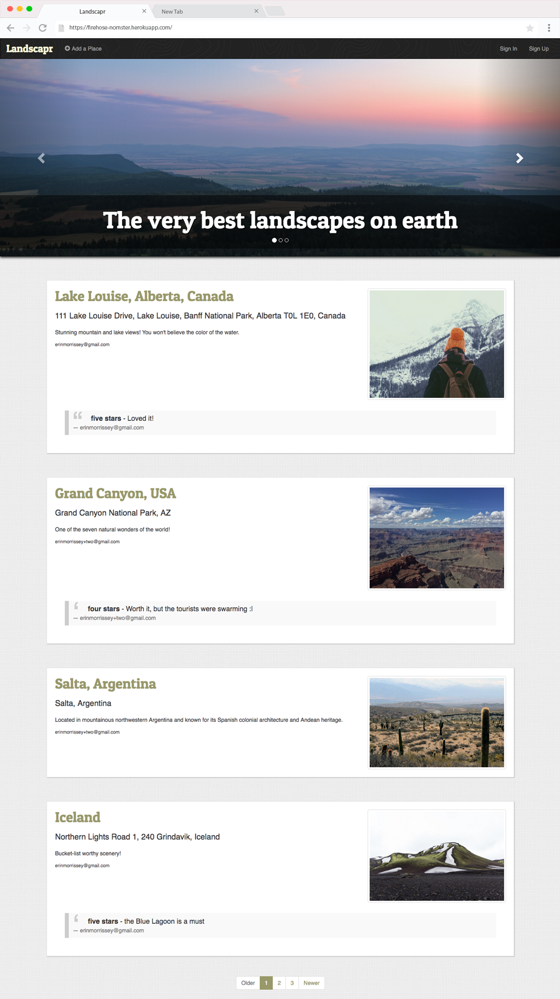
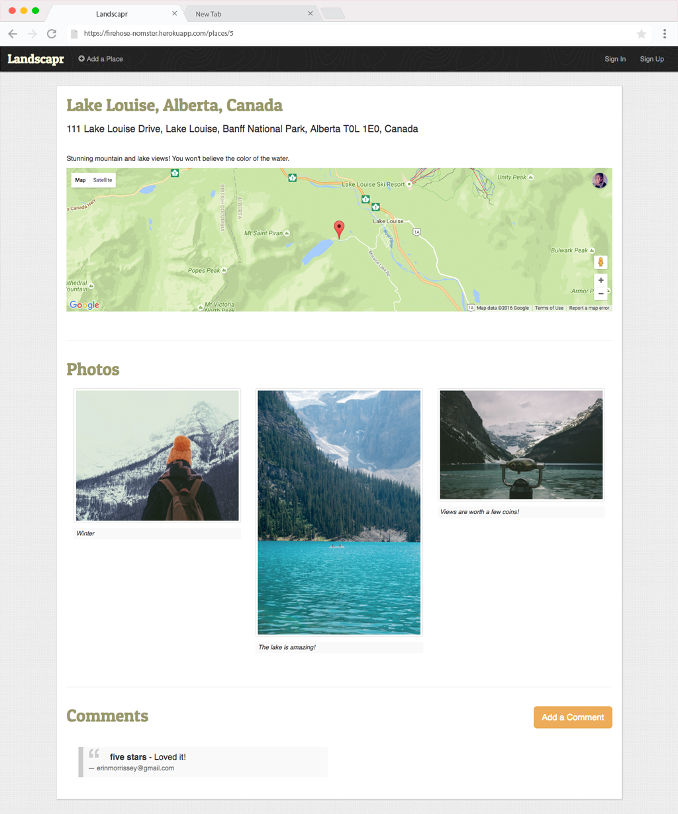

# Nomster

Nomster is a Ruby on Rails *Yelp* clone web application. Users can create a profile, post locations, and comment on & rate other locations.

Visit the deployed application: [https://firehose-nomster.herokuapp.com/](https://firehose-nomster.herokuapp.com/)

___
### Implementation Details:
* Built on Ruby on Rails framework
* PostgreSQL database
* Twitter Bootstrap 3 for CSS and UI components
* Simple Form gem for form implementation
* Modal form location submission
* Validation of form inputs
* Simple Form gem for form implementation
* Devise gem for user authentication
* will_paginate gem for pagination
* Google Maps API (used with Geocoder & Figaro gems) to display location map
* User comment functionality on location records
* CarrierWave gem for image uploading & Amazon Web Services (S3) for photo storage
* User profile page displaying user locations, user comments, and other stats
* Rails mailer used to handle email notification on comment creation
* Responsive design

___
### TODO:
```
- @TODO: Change static text rating display ("Five Stars") to star icon display
- @TODO: Add user avatar functionality
- @TODO: Configure 404 page
- @TODO: Add location search
- @TODO: Swap out user email address for username
- ✅ redirect user to place#show page after successful place update
```

___
### Credits:
* [Unsplash](https://unsplash.com/) for images

___
### Screenshot:



